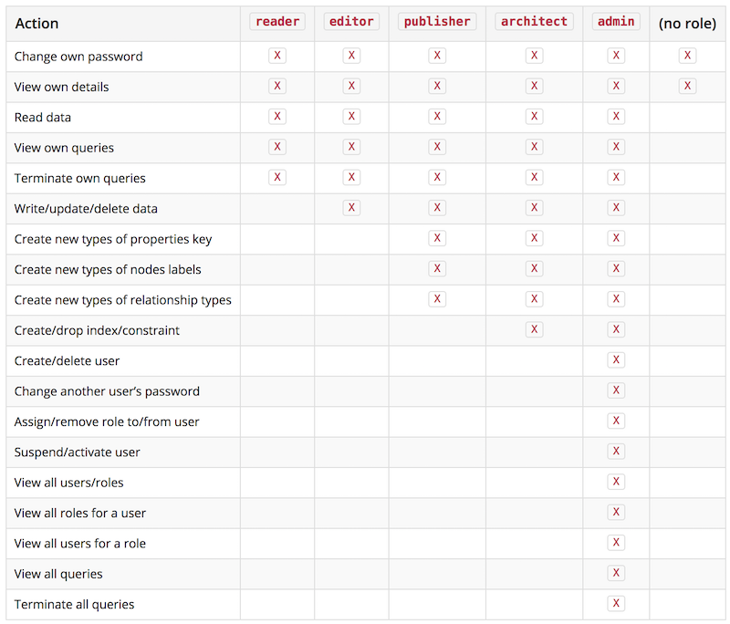

# NEO4J - Übungsprojekt: noSQL
## 1	Einführung
### 1.1	Was ist der Kontext, warum ist das Projekt relevant, und worum geht es?
Dieses Projekt wurde im Kontext des Moduls Datenbanksysteme HS2017 der HSLU durchgeführt. Das Projekt soll das während dem Semester in den Theorieblöcken und mithilfe der Übungsaufgaben angeeignete Wissen durch die Auseinandersetzung mit einer noSQL Technologie und ihren Aspekten vertiefen. Dies soll erreicht werden, indem eine bereits bestehende relationale Datenbank inklusive ihrer Beziehungen komplett in ein anderes Datenbankmanagementsystem migriert wird. Eine vorgegebene SQL-Abfrage soll so in die Sprache des neuen noSQL DBMS (in diesem Fall Cypher) umgeschrieben werden, dass dieselben Datensätze ausgegeben werden.

## 2	Datenmanagement
### 2.1	Um welche Datenbanktechnologie handelt es sich?
Wir benutzen für dieses Projekt die Datenbank Neo4j. Diese ist eine Open-Source-Graphdatenbank, welche mit Java implementiert wurde. Sie erschien 2007 und ist im Vergleich mit anderen Datenbanken auf dem Platz 21 und die beste Graphdatenbank (www.db-engines.com; Stand: 06.12.2017).

### 2.2	Welche Anwendung (Use Case) unterstützt ihre Datenbank?
Zu den Use Cases der Neo4j-Datenbank (und Allgemein von Graphdatenbanken) zählt zum Beispiel Betrugsentdeckung (fraud detection). Dabei müssen Datenbeziehungen in Echtzeit analysiert werden können, um Betrüger frühzeitig erkennen zu können.
Auch sogenannte Knowledge Graphs können dadurch dargestellt werden. Ein Knowledge Graph kann Antworten auf bestimmte Fragen liefern, indem alle möglichen Daten gesammelt und dazu Beziehungen hergestellt werden. Dies wird zum Beispiel von Google genutzt.
Network&IT:
Real-Time Recommendation Engines:
Master Data Management:
Social Network:
Identity&Access Management
https://neo4j.com/use-cases/

Use cases include matchmaking, network management, software analytics, scientific research, routing, organizational and project management, recommendations, social networks, and more.

### 2.3	Welche Daten werden migriert / eingefügt, und wie genau?
Um eine schon bestehende SQL-Datenbank in NEo4j zu migrieren, werden als Erstes alle Tabellen als CSV-Dateien exportiert. Diese Dateien können dann direkt in Neo4j durch den folgenden Cypher-Befehl importieren:
```
LOAD CSV FROM 'file:/assistenten.csv' AS assistenten CREATE (:Assistenten { PersNr: assistenten[0], Name: assistenten[1], Fachgebiet: assistenten[2], Boss: assistenten[3] })
LOAD CSV FROM 'file:/hoeren.csv' AS hoeren CREATE (:Hoeren { Legi: hoeren[0], VorlNr: hoeren[1] })
LOAD CSV FROM 'file:/professoren.csv' AS professoren CREATE (:Professoren { PersNr: professoren[0], Name: professoren[1], Rang:
professoren[2], Raum: professoren[3] })
LOAD CSV FROM 'file:/pruefen.csv' AS pruefen CREATE (:Pruefen { Legi: pruefen[0], Nr: pruefen[1], PersNr: pruefen[2], Note: pruefen[3]})
LOAD CSV FROM 'file:/studenten.csv' AS studenten CREATE (:Studenten { Legi: studenten[0], Name: studenten[1], Semester: studenten[2]})
LOAD CSV FROM 'file:/voraussetzen.csv' AS voraussetzen CREATE (:Voraussetzen { Vorgaenger: voraussetzen[0], Nachfolger: voraussetzen[1]})
LOAD CSV FROM 'file:/vorlesungen.csv' AS vorlesungen CREATE (:Vorlesungen { VorlNr: vorlesungen[0], Titel: vorlesungen[1], KP: vorlesungen[2], GelesenVon: vorlesungen[3]})
```
Wichtig ist zu beachten, dass Neo4J über einen eigenen Import-Folder verfügt und durch file:/ automatisch dort nach der Datei sucht. Somit sollten die CSV-Dateien an diesem Ort abgelegt werden. Zusätzlich müssen beim Importieren alle Informationen bezüglich der Benennung der Spalten der jeweiligen Tabelle angegeben weden.

Beziehungen stellt man in Neo4J mit den folgenden Cypher-Befehlen her:
```
MATCH (a:Assistenten), (p:Professoren) WHERE a.Boss = p.PersNr CREATE (a)-[:Ist_angestellt_von]->(p)
MATCH (p:Professoren), (v:Vorlesungen) WHERE p.PersNr = v.GelesenVon CREATE (p)-[:Liest]->(v)
MATCH (v1:Vorlesungen), (v2:Vorlesungen), (v3:Voraussetzen) WHERE v1.VorlNr=v3.Vorgaenger AND v2.VorlNr=v3.Nachfolger CREATE (v1)-[:Ist_Vorgaenger_Von]->(v2)
MATCH (s:Studenten), (v:Vorlesungen), (h:Hoeren) WHERE s.Legi=h.Legi AND v.VorlNr=h.VorlNr CREATE (s)-[:Besucht]->(v)
```
Dies stellt bei allen Assistenten und Professoren eine Beziehung mit dem Namen „Ist angestellt von“ her, bei denen der Boss von a (Assistenten) gleich der PersNr von p (Professoren) ist.

### 2.4	Wie interagiert der Benutzer mit der Datenbank?
Als Benutzer nutzt man die Abfragesprache Cypher. Cipher ist der SQL-Sprache sehr ähnlich und dadurch für Beginner mit SQL-Vorwissen leicht zu verstehen.

## 3	Datenmodellierung
### 3.1	Welches Datenmodell (ER) liegt ihrem Projekt zugrunde?
Wir nutzen die schon vorliegende Uni-Datenbank. Das SQL-Datenmodell sieht folgendermassen aus:


### 3.2	Wie wird ihr Datenmodell in Ihrer Datenbank in ein Schema übersetzt?
Bei Neo4j wird das Datenmodell durch Knoten, Kanten und deren Beziehungen zu einander dargestellt.


## 4	Datenbanksprachen
### 4.1	Wie werden Daten anhand einer Query abgefragt?
[Queries in Neo4j](https://neo4j.com/developer/cypher-query-language/)

SQL-Query:


Das SQL-Query gibt alle Professoren aus, welche eine Vorlesung mit Studenten abhalten. Ausgegeben werden die Namen der Professoren mit der Anzahl Studenten, welche die Vorlesungen dieses Professors besuchen. Zusätzlich sieht man die Anzahl Credits (SWS), welche man mit den Vorlesungen holen kann.


Neo4j-Query:
```
MATCH(p:Professoren)-[:Liest]->(v:Vorlesungen) 
WHERE p.Name=p.Name
RETURN p.Name AS Professor,sum(SIZE((v)-[:Besucht]-())) AS AnzahlStudenten, sum(toInteger(v.KP)) AS AnzahlSWS
ORDER BY p.Name
```
1. Gibt Vorlesungen, welche besucht werden und die Anzahl der Studenten aus.
2. Gibt den jeweiligen Professor einer Vorlesung aus (nur die die eine halten) und die Credits die man für diese bekommt. 

## 5 Konsistenzsicherung
### 5.1	Wie wird die Datensicherheit gewährleistet?
**Etwas darüber, wie die Daten abgelegt sind?**

Durch Authorisierung der einzelnen Benutzer wird Datensicherheit durch Verhinderung unerlaubter Zugriffe gewährleistet. Unter Neo4j bestehen deshalb die Benutzerrollen *reader, editor, publisher, architect* und *admin*. Benutzern auf der Datenbank werden diese Rollen vom Urheber der Datenbank zugeteilt. Die Benutzerrollen besitzen entsprechende Rechte:



### 5.2	Wie können Transaktionen parallel / konkurrierend verarbeitet werden?
In Neo4j laufen alle Updates des Graphen in einer Transaktion ab. Dies kann auf zwei Arten geschehen. Falls noch keine Transaktion existiert, erstellt Cypher eine Neue und arbeitet den Query ab. Läuft jedoch schon eine Transaktion, wird der neue Query in der alten Transaktion mit abgearbeitet. Erst wenn alle Queries erfolgreich abgeschlossen wurden, werden die Änderung abgespeichert. Dies bedeutet, dass mehrere Queries in nur einer Transaktion auf einmal ausgeführt/abgespeichert werden können.

## 6	Systemarchitektur
### 6.1	Wie ist der Server aufgebaut und wie wurde er installiert?
Auf der offiziellen Website von Neo4j kann man nach der Registrierung die Desktopversion herunterladen und installieren. In dieser Anwendung können verschiedenste Projekte mit der jeweils gewünschten Anzahl Datenbanken verwaltet werden. Möchte man nun mit einer Datenbank arbeiten, wird ein Neo4j Browser geöffnet in dem die Anweisungen und Abfragen gegeben werden können.

### 6.2	Wie kann die Effizienz von Datenanfragen optimiert werden?
In Cypher werden alle Queries durch die Cypher execution engine automatisch optimiert und umgesetzt.
*Um die Abfrage noch mehr zu optimieren, wird vorgeschlagen keine Umbennenungen durchzuführen.*(To minimize the resources used for this, make sure to use parameters instead of literals when possible. This allows Cypher to re-use your queries instead of having to parse and build new execution plans.)--> Versteh ich nicht ganz / Übersetzung richtig?

https://neo4j.com/docs/developer-manual/current/cypher/query-tuning/

## 7	Vergleich mit relationalen Datenbanken
### 7.1	Vergleichen Sie ihre NoSQL-Technologie mit SQL-Datenbanken.
Die Datenabfrage ist in Graphdatenbanken im Vergleich zu den realationalen Datenbank stark optimiert. Um durch eine Graphdatenbank zu traversieren, reicht es aus, die Beziehungskanten (Pfade) des Startknoten zu verfolgen. Dies ist viel schneller als die im SQL genutzten Joins. Zusätzlich kann Neo4j auch besser mit einer grossen Menge an Daten und Beziehungen umgehen. Durch all diese Faktoren leistet diese Datenbanktechnologie eine bessere Performance (vorallem bei grossen Datenmengen).

## 8	Schlussfolgerungen
### 8.1	Was haben Sie erreicht, und welche Erkenntnisse haben sie dabei gewonnen?

### 8.2	Wie beurteilt ihre Gruppe die gewählte Datenbanktechnologie, und was sind Vor- und Nachteile?

#### 8.2.1 Vorteile

#### 8.2.2 Nachteile
